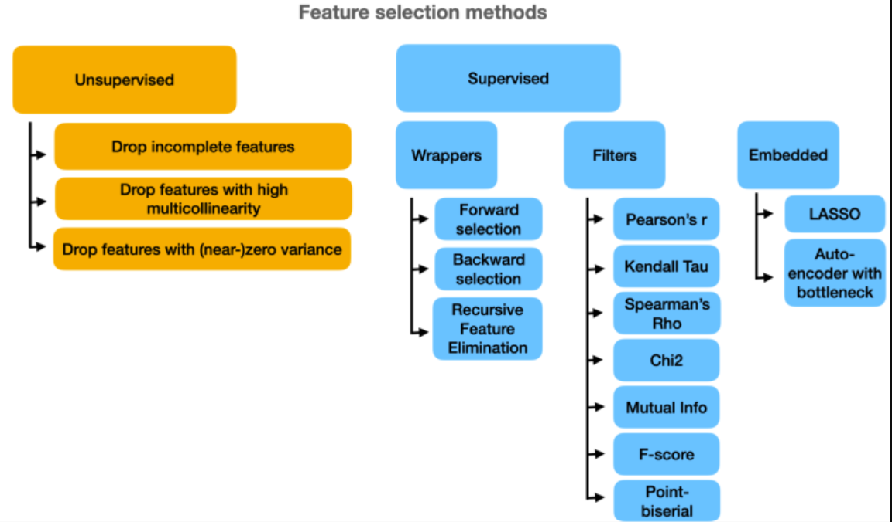
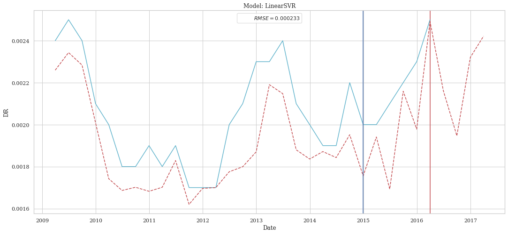
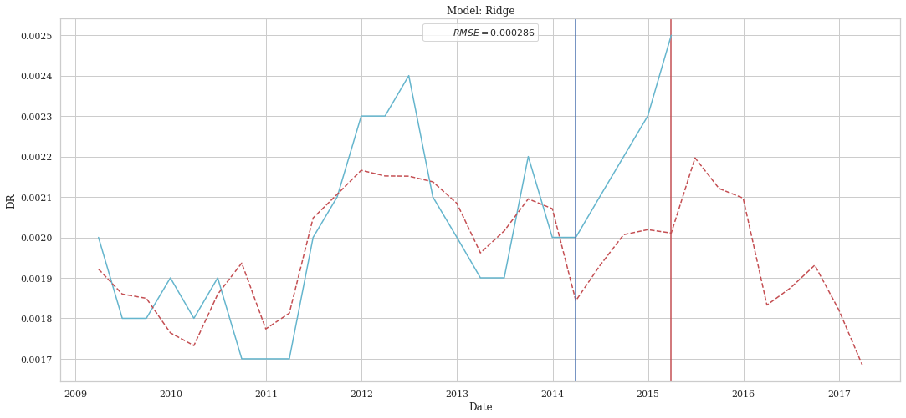
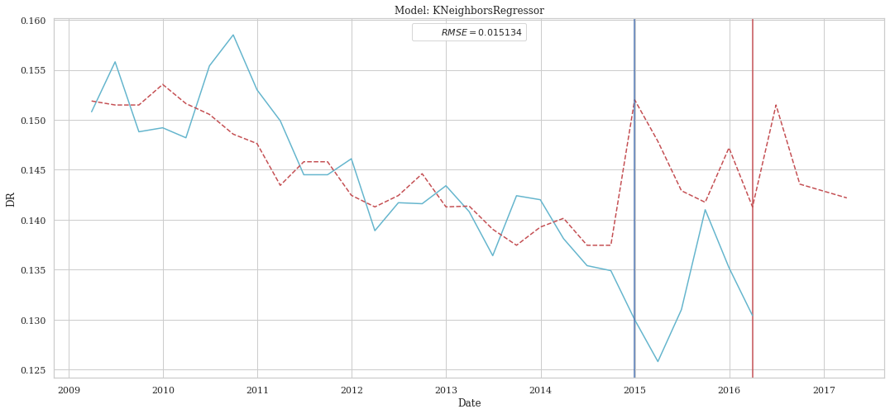
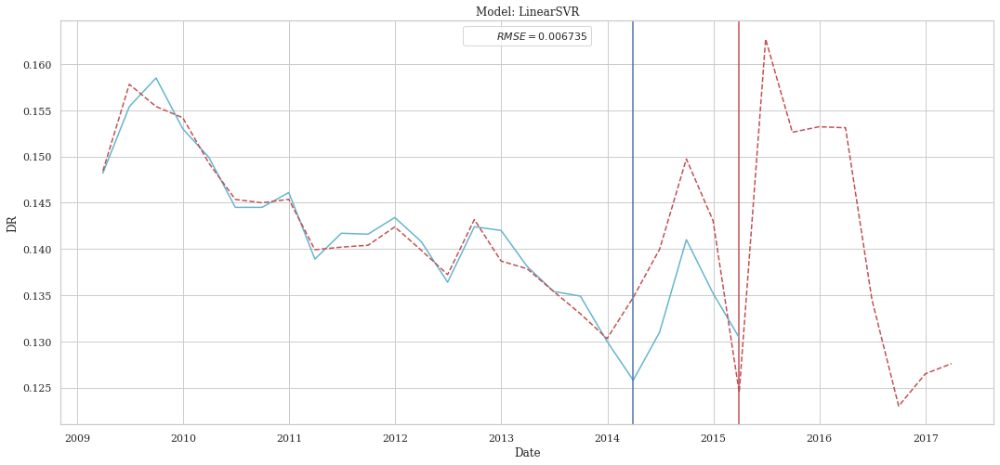
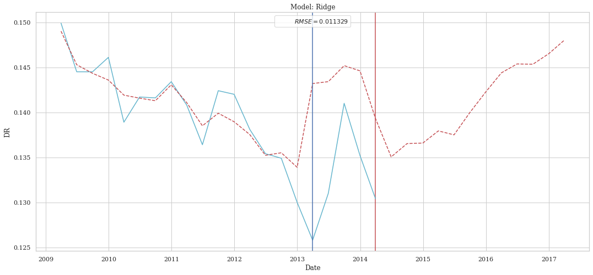
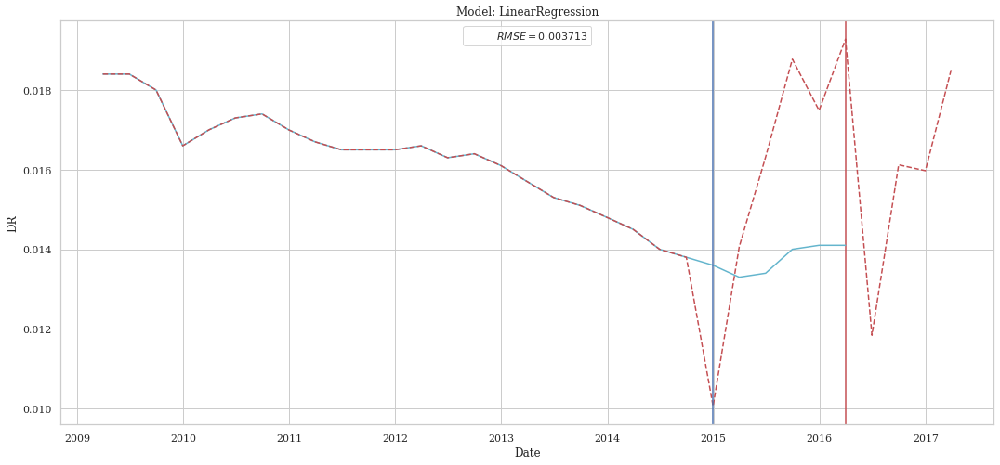
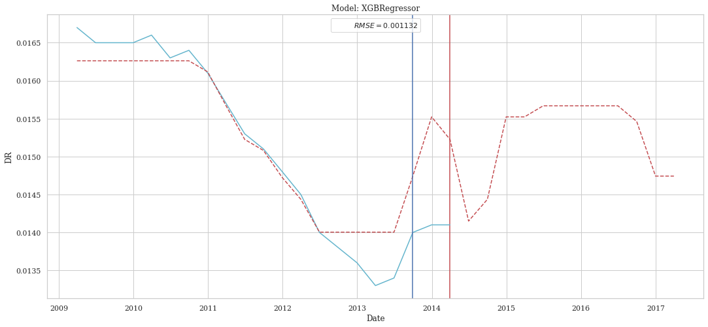

# Drim Game 2022

## Context and Purpose of the project

## Structure of the repository

| Folder | Description |
| --- | --- |
| `basic_exploration` | First exploration |
| `datas` | Differents data sources |
| `DreamLib` | Python scripts used in the Notebook |
| `notebooks` | Jupyter Notebooks |

## DreamLib structure

| Files | Description |
| --- | --- |
| `construction_DreamLib.py` | notebook used to construct the scripts |
| `linear_models.py` | contains the regression functions for the prediction |
| `processing_datas.py` | contains the preprocessing functions to clean the datas |
| `timeseries.py` | models based on the timeseries theory |
| `visualization.py` | functions to plot the datas |

## Notebooks structure

| Files | Description |
| --- | --- |
| `0_exploration.ipynb` | First exploration of the datas and first test |
| `1_vizualisation.ipynb` | Plot of the datas |
| `2_macrodata.ipynb` | Clean of new datas |
| `3.1_features_selection_12.ipynb` | Features selection to predict the DR of 12 months in 12 months |
| `3.2_features_selection_24.ipynb` | Features selection to predict the DR of 12 months in 24 months |
| `3.3_features_selection_36.ipynb` | Features selection to predict the DR of 12 months in 36 months |
| `3.4_features_selection with macro.ipynb` | Features selectionwith new macro datas|
| `4.1_linear_models_12.ipynb` | Linear models to predict the DR of 12 months in 12 months|
| `4.2_linear_models_24.ipynb` | Linear models to predict the DR of 12 months in 24 months|
| `4.3_linear_models_36.ipynb` | Linear models to predict the DR of 12 months in 36 months|
| `5.1_timeseries_12.ipynb` | timeseries models to predict the DR of 12 months in 12 months|
| `5.2_timeseries_24.ipynb` | timeseries models to predict the DR of 12 months in 24 months |
| `5.3_timeseries_36.ipynb` | timeseries models to predict the DR of 12 months in 36 months |

## About features selection



## About linear models

### Linear Regression

`LinearRegression` fits a linear model with coefficients $w = (w_1, ..., w_p)$ to minimize the residual sum of squares between the observed targets in the dataset, and the targets predicted by the linear approximation. Mathematically it solves a problem of the form:

$$
\underset{\omega}{\text{min}}||X{\omega}-y||_{2}^{2}
$$

### Ridge Regression

`Ridge` regression addresses some of the problems of Ordinary Least Squares by imposing a penalty on the size of the coefficients. The ridge coefficients minimize a penalized residual sum of squares:
$$\min_{w} || X w - y||_2^2 + \alpha ||w||_2^2$$

The complexity parameter $\alpha \ge 0$ controls the amount of shrinkage: the larger the value of $\alpha$, the greater the amount of shrinkage and thus the coefficients become more robust to collinearity.

### Lasso

The `Lasso` is a linear model that estimates sparse coefficients. It is useful in some contexts due to its tendency to prefer solutions with fewer non-zero coefficients, effectively reducing the number of features upon which the given solution is dependent. For this reason, Lasso and its variants are fundamental to the field of compressed sensing. Under certain conditions, it can recover the exact set of non-zero coefficients.

Mathematically, it consists of a linear model with an added regularization term. The objective function to minimize is:

$$\min_{w} { \frac{1}{2n_{\text{samples}}} ||X w - y||_2 ^ 2 + \alpha ||w||_1}$$

### Elastic Net

`ElasticNet` is a linear regression model trained with both $\ell_1$ and $\ell_2$-norm regularization of the coefficients. This combination allows for learning a sparse model where few of the weights are non-zero like Lasso, while still maintaining the regularization properties of Ridge. We control the convex combination of $\ell_1$ and $\ell_2$ using the l1_ratio parameter.

Elastic-net is useful when there are multiple features that are correlated with one another. Lasso is likely to pick one of these at random, while elastic-net is likely to pick both.

A practical advantage of trading-off between Lasso and Ridge is that it allows Elastic-Net to inherit some of Ridge’s stability under rotation.

The objective function to minimize is in this case:
$$\min_{w} { \frac{1}{2n_{\text{samples}}} ||X w - y||_2 ^ 2 + \alpha \rho ||w||_1 +
\frac{\alpha(1-\rho)}{2} ||w||_2 ^ 2}$$

The class ElasticNetCV can be used to set the parameters alpha ($\alpha$) and l1_ratio ($\rho$) by cross-validation.

### XGBRegressor

`XGBRegressor` provides a parallel tree boosting. It means that it will train many decision trees at the same time, and it will correct the mistakes of the previously trained decision trees.

### LinearSVR

`LinearSVR` implements support vector regression for the case of a linear kernel. Support vector regression means that the target value is expected to be within the epsilon tube around the prediction. 

$$ \min_{w, \xi} \frac{1}{2} ||w||^2_2 + C \sum_{i=1}^n \xi_i $$

### KNeighborsRegressor

`KNeighborsRegressor` implements learning based on the k nearest neighbors of each query point, where $k$ is an integer value specified by the user. The output is the property value for the object. This value is the average of the values of its $k$ nearest neighbors.

### DecisionTreeRegressor

`DecisionTreeRegressor` is a class capable of performing multi-output regression on a dataset. The goal is to create a model that predicts the value of a target variable by learning simple decision rules inferred from the data features.

### CatBoostRegressor

`CatBoostRegressor` is a gradient boosting on decision trees library with categorical features support out of the box. It is based on gradient boosting algorithm with several improvements like handling categorical features automatically, better handling of numerical features, regularization, and others.

## Results found

To laucnh a model the code has the following structure for example for `CHR2`, `12 months period`, `the forward sequential period` and `the linear SVR model` :

```python
chronique=b'CHR2'
start = 1
period = 12
norm = "MinMax"
split = 0.2
X_train, X_test, y_train, y_test,X_validation = clean_data(data,start,chronique=chronique,period=period,col_used=cl.col_2_seq_for,split=split,norm=norm)
index = pd.concat([X_train, X_test,X_validation], axis=1).index
summary = summary_ml(X_train,y_train,X_test,y_test,models=['svr'])
for i in range(summary.shape[0]): 
  y_train_pred = y_pred(X_train,y_train,X_train,y_train,model=summary.index[i])
  y_test_pred = y_pred(X_train,y_train,X_test,y_test,model=summary.index[i])
  y_validation_pred = y_pred(X_train,y_train,X_validation,y_test=False,model=summary.index[i])
  plot_pred_detail(y_train,y_test,y_train_pred,y_test_pred,index,name_model=summary.index[i],y_validation=y_validation_pred,period=period,df_score=summary)
```

By applying to all chronique we obtain the following plot.

### CHR2

For the CHR2 portfolio we obtain the following predictions for `12`, `24` and `36` months :

#### 12 months



#### 24 months



#### 36 months


### CHR8

For the CHR8 portfolio we obtain the following predictions for `12`, `24` and `36` months :

#### 12 months



#### 24 months



#### 36 months




### CHR Total

For the CHR Totale portfolio we obtain the following predictions for `12`, `24` and `36` months :

#### 12 months



#### 36 months

