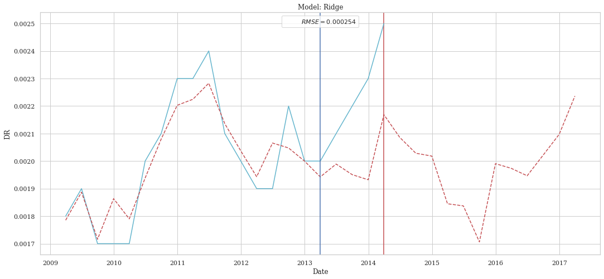

# Drim Game 2022

## Context and Purpose of the project

Bank wants to calculate the default risk probability of loan applicants based on their financial history over all other financial institutes

Credit Risk parameter forecasting models:
* `IFRS 9`
* `Credit-stress test systems`

Then the main goal is to `predict the annual default rate` for different time horizons within `portfolio of loans` intended for the purchase of automobiles by retail counterparty. The different time horizons are `12`, `24` and `36` months.

## Structure of the repository

| Folders | Description |
| --- | --- |
| `basic_exploration` | First exploration |
| `datas` | Differents data sources |
| `DreamLib` | Python scripts used in the Notebook |
| `notebooks` | Jupyter Notebooks |
| `img` | Images used in the README |

## DreamLib structure

| Files | Description |
| --- | --- |
| `construction_DreamLib.py` | notebook used to construct the scripts |
| `linear_models.py` | contains the regression functions for the prediction |
| `processing_datas.py` | contains the preprocessing functions to clean the datas |
| `timeseries.py` | models based on the timeseries theory |
| `visualization.py` | functions to plot the datas |

We build this library in order to not load too much the jupyter notebook.

## Notebooks structure

| Notebooks | Description |
| --- | --- |
| `0_exploration.ipynb` | First exploration of the datas and first test |
| `1_vizualisation.ipynb` | Plot of the datas |
| `2_macrodata.ipynb` | Clean of new datas |
| `3.1_features_selection_12.ipynb` | Features selection to predict the DR of 12 months in 12 months |
| `3.2_features_selection_24.ipynb` | Features selection to predict the DR of 12 months in 24 months |
| `3.3_features_selection_36.ipynb` | Features selection to predict the DR of 12 months in 36 months |
| `3.4_features_selection with macro.ipynb` | Features selectionwith new macro datas|
| `4.1_linear_models_12.ipynb` | Linear models to predict the DR of 12 months in 12 months|
| `4.2_linear_models_24.ipynb` | Linear models to predict the DR of 12 months in 24 months|
| `4.3_linear_models_36.ipynb` | Linear models to predict the DR of 12 months in 36 months|
| `5.1_timeseries_12.ipynb` | timeseries models to predict the DR of 12 months in 12 months|
| `5.2_timeseries_24.ipynb` | timeseries models to predict the DR of 12 months in 24 months |
| `5.3_timeseries_36.ipynb` | timeseries models to predict the DR of 12 months in 36 months |

## About TimeSeries models

### ARIMA

`ARIMA` neans *AutoRegressive Integrated Moving Average*. It is a class of statistical models for analyzing and forecasting time series data. `ARIMA` models are denoted with the notation `ARIMA(p, d, q)`. These three parameters account for seasonality, trend, and noise in data.

- `p` is the order of the AR term. $X_t = \mu + \phi_1 X_{t-1} + \phi_2 X_{t-2} + ... + \phi_p X_{t-p} + \epsilon_t$
- `d` is the degree of differencing (the number of times the data have had past values subtracted). $\Delta X_t = X_t - X_{t-1}$
- `q` is the order of the MA term. $X_t = \mu + \epsilon_t + \theta_1 \epsilon_{t-1} + \theta_2 \epsilon_{t-2} + ... + \theta_q \epsilon_{t-q}$

### ARIMAX

`ARIMAX` means *AutoRegressive Integrated Moving Average with eXogenous regressors*. It's an extension of ARIMA that allows to take into account external variables that can have an impact on the time series.

$$ X_t = \mu + \phi_1 X_{t-1} + ... + \phi_p X_{t-p} + \epsilon_t + ... + \theta_q \epsilon_{t-q} + \beta_1 Z_{1,t} + \beta_2 Z_{2,t} + ... $$


## About features selection


### Unsupervised feature selection

- `Low variance filter` : drop features with high multicollinearity and with low variance (low information content)
- `Tree based feature selection` : Select features based on the importance weights of an extra-trees classifier. The higher, the more important the feature. The importance of a feature is computed as the (normalized) total reduction of the criterion brought by that feature. It is also known as the Gini importance.

### Wrapper methods

- `Backward selection` : Select features by recursively considering smaller and smaller sets of features. The importance of each feature is measured by a score function; the linear regression model is used to compute the score function.
- `Forward selection` :  Select features by recursively considering larger and larger sets of features. The importance of each feature is measured by a score function; the linear regression model is used to compute the score function.
- `Recursive feature elimination` : Select features by recursively considering smaller and smaller sets of features. The importance of each feature is measured by a score function; the linear regression model is used to compute the score function.

### Filter methods

- `Correlation analysis` : keep features with high correlation with the target and low correlation with between them
- `K-best features` : keep the k best features according to a statistical test; it's f_regression for us (linear regression)

## About linear models

### Linear Regression

`LinearRegression` fits a linear model with coefficients $w = (w_1, ..., w_p)$ to minimize the residual sum of squares between the observed targets in the dataset, and the targets predicted by the linear approximation. Mathematically it solves a problem of the form:

$$
\underset{\omega}{\text{min}}||X{\omega}-y||_{2}^{2}
$$

### Ridge Regression

`Ridge` regression addresses some of the problems of Ordinary Least Squares by imposing a penalty on the size of the coefficients. The ridge coefficients minimize a penalized residual sum of squares:
$$\min_{w} || X w - y||_2^2 + \alpha ||w||_2^2$$

### Lasso

The `Lasso` is a linear model that estimates sparse coefficients. It is useful in some contexts due to its tendency to prefer solutions with fewer non-zero coefficients, effectively reducing the number of features upon which the given solution is dependent.
$$\min_{w} { \frac{1}{2n_{\text{samples}}} ||X w - y||_2 ^ 2 + \alpha ||w||_1}$$

### Elastic Net

`ElasticNet` is a linear regression model trained with both $\ell_1$ and $\ell_2$-norm regularization of the coefficients. Elastic-net is useful when there are multiple features that are correlated with one another.
$$\min_{w} { \frac{1}{2n_{\text{samples}}} ||X w - y||_2 ^ 2 + \alpha \rho ||w||_1 +
\frac{\alpha(1-\rho)}{2} ||w||_2 ^ 2}$$

### XGBRegressor

`XGBRegressor` provides a parallel tree boosting. It means that it will train many decision trees at the same time, and it will correct the mistakes of the previously trained decision trees.

### LinearSVR

`LinearSVR` implements support vector regression for the case of a linear kernel. A support vector regression is a regression algorithm that builds a model by learning the error of the prediction for each sample. A linear kernel is a dot product between the samples.
$$ \min_{w, \xi} \frac{1}{2} ||w||^2_2 + C \sum_{i=1}^n \xi_i $$

### KNeighborsRegressor

`KNeighborsRegressor` implements learning based on the k nearest neighbors of each query point, where $k$ is an integer value specified by the user. The output is the average of the values of its $k$ nearest neighbors.

### DecisionTreeRegressor

`DecisionTreeRegressor` is a model that predicts the value of a target variable by learning simple decision rules inferred from the data features.

### CatBoostRegressor

`CatBoostRegressor` is a gradient boosting on decision trees library with categorical features support out of the box. It is based on gradient boosting algorithm with several improvements like handling categorical features automatically, better handling of numerical features, regularization, and others.

## Results found

To launch a model the code has the following structure for example for `CHR2`, `12 months period`, `the forward sequential period` and `the linear SVR model` :

Firstly we set all features, the `chronique`, the `start`, the `period`, the `norm`, and the `split`.

```python
chronique=b'CHR2'
start = 1
period = 12
norm = "MinMax"
split = 0.2
```

Then we need to clean the data in order to get `X_train`, `X_test`, `y_train`, `y_test` and `X_validation`. Also we set the index and the summary of the model, which allows us to obtain the `rmse`, the `mse`, the `mae` and the `r2`.

```python
X_train, X_test, y_train, y_test,X_validation = clean_data(data,start,chronique=chronique,period=period,col_used=cl.col_2_seq_for,split=split,norm=norm)
index = pd.concat([X_train, X_test,X_validation], axis=1).index
summary = summary_ml(X_train,y_train,X_test,y_test,models=['svr'])
```

Finally we build the plot to see ou prediction.

```python
for i in range(summary.shape[0]): 
  y_train_pred = y_pred(X_train,y_train,X_train,y_train,model=summary.index[i])
  y_test_pred = y_pred(X_train,y_train,X_test,y_test,model=summary.index[i])
  y_validation_pred = y_pred(X_train,y_train,X_validation,y_test=False,model=summary.index[i])
  plot_pred_detail(y_train,y_test,y_train_pred,y_test_pred,index,name_model=summary.index[i],y_validation=y_validation_pred,period=period,df_score=summary)
```

By applying to all chronique we obtain the following plot.

### CHR2

For the CHR2 portfolio we obtain the following predictions for `12`, `24` and `36` months :

#### 12 months


#### 24 months


#### 36 months



### CHR8

For the CHR8 portfolio we obtain the following predictions for `12`, `24` and `36` months :

#### 12 months


#### 24 months


#### 36 months


### CHR Total

For the CHR Totale portfolio we obtain the following predictions for `12`, `24` and `36` months :

#### 12 months


#### 24 months


#### 36 months

